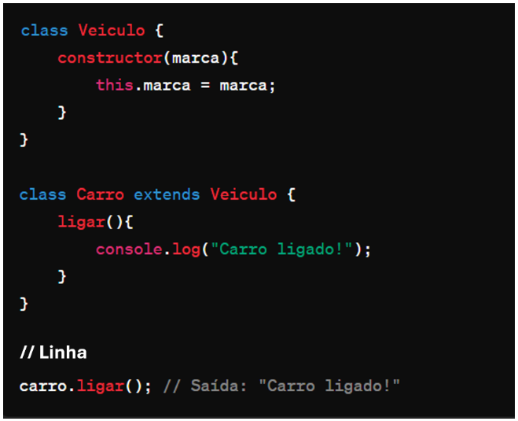

# Instruções

- Faça uma cópia deste arquivo .md para um repositório próprio
- Resolva as 6 questões objetivas assinalando a alternativa correta
- Resolva as 4 questões dissertativas escrevendo no próprio arquivo .md
  - lembre-se de utilizar as estruturas de código como ``esta aqui com ` `` ou
```javascript
//esta aqui com ```
let a = "olá"
let b = 10
print(a)
```
- Resolva as questões com uso do Visual Studio Code ou ambiente similar.
- Teste seus códigos antes de trazer a resposta para cá.
- Cuidado com ChatGPT e afins: entregar algo só para ganhar nota não faz você aprender e ficar mais inteligente. Não seja dependente da máquina!
- ao final, publique seu arquivo lista_01.md com as respostas em seu repositório, e envie o link pela Adalove. 

# Questões objetivas

**Respostas em negrito**

**1)** O que o código a seguir faz?


Escolha a opção que responde corretamente:

a) Imprime os números pares de 1 a 10.

b) Imprime os números ímpares de 1 a 10.

**_c) Imprime os números pares de 2 a 10._**

d) Imprime os números ímpares de 2 a 10.

______

**2)** Identificar a linha que falta no código para criar uma classe Veiculo com atributo marca, e uma classe Carro que herda de Veiculo com um método ligar(). 



No lugar onde está escrito “// linha” qual das opções abaixo deve estar para funcionar corretamente o código?

**_A) let carro = new Carro("Toyota");_**

B) let ligar = new ligar("Toyota");

C) class Moto extends Veiculo {};

D) carro1.ligar();

______

**3)** Qual é o valor de resultado após a execução deste código?


Escolha a opção que responde corretamente:

**_A) 18_**

B) 16

C) 14

D) 12

______

**4)** Como você criaria um método `acelerar()` em uma classe `Carro`, que recebe um parâmetro `velocidade` e o adiciona a um atributo `velocidadeAtual`?

**_A) -> _**

B) 

C) 

D) 

______

**5)** Qual a forma correta de definir uma classe Carro em JavaScript, com um método ligar() e um atributo marca?

**A) -> **

B) 

C) 

D) 

______

**6)** Observe o código abaixo:


Qual será a saída do código acima?

**_A) "Olá, meu nome é João. Olá, meu nome é Maria."_**

B) "Olá, meu nome é ."

C) "João Maria"

D) "undefined undefined"

______

# Questões dissertativas

**7)** Vamos criar um programa em JavaScript para entender classes, métodos e atributos!
Classe Animal:
- Crie uma classe chamada Animal.
- Adicione dois atributos: nome e idade.
- Adicione um método chamado descrever() na classe Animal.
  - Este método deve exibir no console uma descrição do animal com seu nome e idade.

Criando e manipulando Animais:
- Crie dois objetos da classe Animal: um chamado "cachorro" e outro "gato", com idades distintas.
- Para cada animal, chame o método descrever() para ver a descrição no console.

Dica: Utilize `console.log()` para exibir as informações!

**Resolução**
```javascript
//criando a classe animal
class Animal {
    constructor (nome, idade) {
        this.nome = nome; //criando o atributo nome
        this.idade = idade; //criando o atributo idade
    }
    descrever() {
        console.log(`O ${this.nome} tem ${this.idade} anos.`); //descrevendo o animal de acordo como o nome e idade definidos
    }
}

let animal1 = new Animal('cachorro', 7); //criando um objeto da classe animal com os atributos definidos
animal1.descrever(); //utilizando o método para imprimir a descrição
let animal2 = new Animal('gato', 3); //criando um objeto da classe animal com os atributos definidos
animal2.descrever(); //utilizando o método para imprimir a descrição 
```

______

**8)** Nos últimos dias tivemos a oportunidade de ter contato com Programação Orientada a Objetos, e tivemos contato com o tema "herança". Herança é um princípio de orientação a objetos, que permite que classes compartilhem atributos e métodos. Ela é usada na intenção de reaproveitar código ou comportamento generalizado ou especializar operações ou atributos. Então vamos praticar esse conteúdo nessa questão.
Vamos criar um programa em JavaScript para entender classes, métodos, atributos e herança!

Classe Animal:
- Crie uma classe chamada Animal.
- Adicione dois atributos: nome e idade.
- Adicione um método descrever() que exiba no console uma descrição do animal com seu nome e idade.

Classe Gato (Herda de Animal):
- Crie uma classe chamada Gato que herda da classe Animal.
- Adicione um atributo extra cor específico para gatos.
- Adicione um método miar() que exiba no console o som que um gato faz.

Criando Animais:
- Crie dois objetos da classe Animal: um chamado cachorro e outro gato, com idades distintas.
- Para o gato, também defina a cor.

Chamando os Métodos:
- Para cada animal, chame o método descrever() para ver a descrição no console.
- Para o gato, chame o método miar() para "ouvir" o som que ele faz (é também para ver o som no console).

Dica: Utilize console.log() para exibir as informações!

**Resolução**
```javascript
//criando a classe animal
class Animal {
    constructor (nome, idade) {
        this.nome = nome; //criando o atributo nome
        this.idade = idade; //criando o atributo idade
    }
    descrever() {
        console.log(`O ${this.nome} tem ${this.idade} anos.`); //descrevendo o animal de acordo como o nome e idade definidos
    }
}

//criando a classe gato que herda os atributos da classe animal
class Gato extends Animal {
    constructor(nome, idade, cor) { 
        super(nome, idade); //atributos que estão sendo herdados
        this.cor = cor; //novo atributo
    }
    
    descrever() { //criando o método descrever 
        console.log(`O ${this.nome} é ${this.cor} e tem ${this.idade} anos.`); //imprimindo uma descrição com os atributos criados
    }
    miar() { //criando o método miar
        console.log('miauuu'); //imprimindo o som que o gato faz ao miar
    }
}

let animal1 = new Animal('cachorro', 7); //criando um objeto da classe animal com os atributos dessa classe
animal1.descrever(); //utilizando o método descrever que imprimirá uma descrição com os atributos definifos
let animal2 = new Gato ('gato', 3, 'laranja'); //criando um objeto da classe gato com os atributos herdados e o novo de cor
animal2.descrever(); //utilizando o método descrever que imprimirá uma descrição com os atributos definifos
animal2.miar(); //utilizando o método que irá imprimir o som de um gato miando
```
______

**9)** Vamos criar um programa em JavaScript para somar notas!

Classe SomadorDeNotas:
- Crie uma classe chamada SomadorDeNotas.
- Adicione um atributo total inicializado com 0 para armazenar a soma das notas.

Método adicionarNota:
- Adicione um método chamado adicionarNota(nota) na classe SomadorDeNotas.
- Este método deve receber um parâmetro nota e somá-lo ao atributo total.

Criando o Somador e Adicionando Notas:
- Crie um objeto da classe SomadorDeNotas, chamado somador.
- Utilize o método adicionarNota(nota) para adicionar algumas notas ao somador.

Chamando o Método para Ver o Total:
- Após adicionar todas as notas, chame um método verTotal() para exibir o total das notas adicionadas.

Dica: Utilize console.log() para exibir as informações!

**Resolução**
```javascript
//criando a classe somadora de notas
class SomadorDeNotas {
    constructor () {
        this.total = 0; //definindo nota total como um atributo
    }
    adicionarNotas(nota) { //fazendo o calculo da nota de acordo com a que for dada
        this.total = this.total + nota; //a cada nova nota, será acrescentado o valor no total.
    }
    verTotal() {
        console.log(`A sua nota total é ${this.total}`); //exibindo o resultado 
    }
}

aluno1 = new SomadorDeNotas; //criando um novo objeto aluno na classe somador de notas
aluno1.adicionarNotas(10); //adicionando nova nota (total 10)
aluno1.adicionarNotas(9); //adicionando novas notas (total 19)
aluno1.adicionarNotas(8) //adicionando novas notas (total 27)
aluno1.verTotal(); //exibindo o total de 27
```

______

**10)** Imagine que você está criando um programa em JavaScript para uma escola. Neste programa, existem diferentes tipos de funcionários, cada um com suas próprias características. Considere as seguintes classes:

Funcionário:
- atributo: Nome
- atributo: Idade
- atributo: Salário base
- método: calcularSalario() - Este método calcula o salário total do funcionário. Para cada tipo de funcionário, o cálculo será diferente.

Professor (herança de Funcionário):
- atributo: Disciplina
- atributo: Horas de aula por semana
- método: calcularSalario() - Para calcular o salário do professor, multiplicamos suas horas de aula pelo valor da hora/aula.

Agora, sua tarefa é escrever um código em JavaScript que crie as classes Funcionário e Professor, com suas características e métodos descritos acima. Depois de criar as classes, crie:
- Dois objetos do tipo Professor com informações fictícias.
- Para cada objeto, chame o método calcularSalario() e mostre o salário calculado no console.

Certifique-se de explicar cada parte do código utilizando comentários, explicando para que serve cada atributo e método, bem como a lógica por trás do cálculo de salário para o tipo de funcionário Professor.

**Resolução**
```javascript
//criando a classe funcionário
class Funcionario {
    constructor(nome, idade, salarioBase) {
        this.nome = nome; //atribuindo um nome
        this.idade = idade; //atribuindo idade
        this.salarioBase = salarioBase; //atribuindo um salário base
    }

    calcularSalarioHora() {
        //o salário é calculado dividindo o salário base pelo número de horas de trabalho no mês (considerando 40 horas semanais)
        return this.salarioBase / 160; // 40 horas semanais * 4 semanas = 160 horas mensais
    }
}

//criando a classe professor que herda os atributos da classe funcionário
class Professor extends Funcionario {
    constructor(nome, idade, salarioBase, horas, qtDisciplina) {
        super(nome, idade, salarioBase); //herdando atributos da classe funcionário
        this.horasSemanais = horas; //horas semanais por disciplina
        this.qtDisciplina = qtDisciplina; //quantidade de disciplinas 
    }

    calcularSalarioTotal() {
        //o salário do professor é calculado multiplicando o valor da hora/aula pelo número de horas semanais e pela quantidade de disciplinas
        console.log(`${this.nome} - Salário total: R$ ${(this.salarioBase * this.horasSemanais * this.qtDisciplina * 4).toFixed(2)}`); // 4 semanas no mês
    }
}

let professor1 = new Professor('Jean', 20, 4580.57, 15, 2); //criando um novo objeto da classe professor
professor1.calcularSalarioTotal(); //utilizando o método de calcular o salário total

let professor2 = new Professor('Natalia', 40, 4580.57, 12, 3); //criando um novo objeto da classe professor
professor2.calcularSalarioTotal(); //utilizando o método de calcular o salário
```